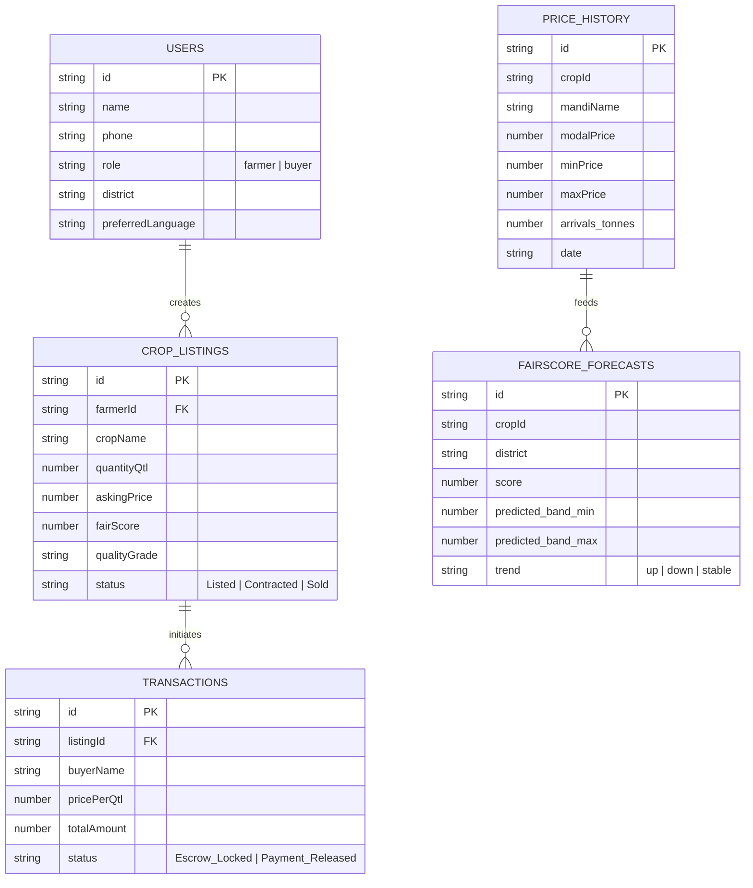

# 🌾 KrishiSetu (कृषिसेतु) — Comprehensive Hackathon Blueprint & Evaluation Guide

> **Project Name:** KrishiSetu (🌾 कृषिसेतु) – Smart Agricultural Price Discovery & Direct Market Linkages Platform  
> **Target Domains:** AgTech, AI for Social Good, Vernacular FinTech, Supply Chain Efficiency  
> **PDF Copy Generated:** [`KrishiSetu_Hackathon_Comprehensive_Guide.pdf`](file:///C:/Users/B%20R%20ANISH/Downloads/kisan-main/kisan-main/KrishiSetu_Hackathon_Comprehensive_Guide.pdf)

---

## 🏆 Executive Summary for Hackathon Evaluators

In India, **over 86% of farmers are smallholders** who suffer an estimated **$40 Billion annual loss** due to distress sales. This is caused by:
1. Asymmetric market price information at APMC mandis.
2. Unaccounted freight and hidden handling charges by commission agents.
3. Arbitrary quality grading without objective standards.
4. Language and literacy barriers in traditional digital tools.

**KrishiSetu** bridges this gap by combining **real-time APMC Mandi price discovery**, **Google Gemini 2.0 AI vernacular voice advisory**, **FairScore™ quality-indexed pricing algorithms**, and **escrow-backed digital contract linkages** into a unified, full-stack platform.

---

## 🌾 Part 1: Practical & Business Working (User Perspective)

This section describes how the platform functions in the hands of real farmers and institutional buyers.

### 1. End-to-End User Journeys

#### A. Smallholder Farmer Journey
1. **Vernacular Voice Search**: The farmer opens the web app and speaks in their regional language (e.g., *"What is the best price for my 50 quintals of Wheat near Ludhiana?"*).
2. **Net Realization Discovery**: The app shows modal prices across nearby APMC mandis and automatically deducts transport/freight costs per quintal, revealing the **true net earnings**.
3. **Quality Assessment & FairScore™**: The farmer enters or scans crop parameters (moisture content, foreign matter). KrishiSetu calculates an objective **FairScore™ (0–100)** and sets a guaranteed floor price above the Cost of Production (CoP) and MSP.
4. **Lot Inspection Certificate**: The system generates a downloadable **PDF Lot Inspection Certificate** complete with a digital verification code.
5. **Direct Listing & Escrow Sale**: The batch is listed on the marketplace. When an FPO or bulk buyer accepts, payment is locked into an Escrow account until delivery confirmation.

#### B. Institutional Buyer / FPO Journey
1. **Verified Listing Browse**: Buyers filter produce by location, crop grade (A+, A, B), moisture levels, and FairScore™.
2. **Escrow Contract Generation**: The buyer accepts a batch; a digital contract voucher is auto-generated with transparent delivery terms.
3. **Fund Release**: Once produce passes physical verification at the delivery hub, escrow funds are instantly released to the farmer's bank account.

---

## ⚡ Part 2: Technical Architecture & Engineering (Under the Hood)

### 1. System Technology Stack

| Layer | Technology | Function & Implementation |
| :--- | :--- | :--- |
| **Frontend UI** | React 19, TypeScript, Vite 6, Tailwind CSS v4, Lucide Icons | Ultra-responsive SPA UI, optimistic state updates, accessible modals, mobile-first design system. |
| **Backend Server** | Node.js, Express.js, ESBuild | Bundled Node.js runtime (`dist/server.cjs`), REST API endpoints, SPA static asset serving. |
| **Database** | MongoDB 7.6 Driver, MongoDB Atlas Cloud | Persistent MongoDB collections with resilient cloud fallback & background retry handlers. |
| **AI Engine** | Google Gemini 2.0 (`@google/genai`) | Natural language context processing, vernacular dialect prompt engineering, harvest risk advisory. |
| **Utility Engines** | `jsPDF`, Recharts, Web Speech API | Client-side PDF generation (`generateLotInspectionReportPdf.ts`), real-time price charts, browser speech synthesis/recognition. |

---

### 2. MongoDB Database Schema Design

The platform relies on 5 primary MongoDB collections defined in [`server/mongodb.ts`](file:///c:/Users/B%20R%20ANISH/Downloads/kisan-main/kisan-main/server/mongodb.ts):

---

### 3. API Routing Specifications

- **`GET /api/health`**: Server health check and system availability status.
- **`GET /api/mongodb-status`**: Diagnostics endpoint returning active database mode (Cloud vs. In-Memory fallback) and document counts.
- **`GET /api/listings` & `POST /api/listings`**: CRUD endpoints for farmer crop batch inventory.
- **`GET /api/price-history`**: Historical APMC market price retrieval filtered by crop ID and district.
- **`POST /api/advisor/chat`**: Interacts with `@google/genai` API with system instructions enforcing Indian agricultural units (Quintal, Acre, INR).
- **`POST /api/transactions`**: Handles transaction creation, escrow status updates, and voucher metadata.

---

## 📊 Part 3: Technical vs. Practical Matrix

| Feature Domain | Practical Working (Farmer/Buyer Experience) | Technical Architecture (Code Implementation) |
| :--- | :--- | :--- |
| **Mandi Price Discovery** | Displays nearby mandi prices minus transport costs to show net profit. | Net Realization = `ModalPrice - FreightRate(DistanceKm) - HandlingFee(%)`. Queries `price_history`. |
| **Vernacular Voice AI** | Speech-in, speech-out interaction in 9 Indian languages. | Web Speech API converts audio -> text -> POST `/api/advisor/chat` -> Gemini 2.0 AI prompt -> Speech Synthesis playback. |
| **FairScore™ Engine** | Objective score (0-100) preventing predatory low-ball pricing. | Weighted algorithm incorporating MSP baseline, standard Cost of Production (CoP), moisture deduction, and local market demand. |
| **Lot Certificate** | Official downloadable PDF report with QR/verification code. | [`generateLotInspectionReportPdf.ts`](file:///c:/Users/B%20R%20ANISH/Downloads/kisan-main/kisan-main/src/utils/generateLotInspectionReportPdf.ts) renders visual badge, tables, and verification code via `jsPDF`. |
| **Escrow Marketplace** | Buyer locks funds upon booking; funds release automatically on delivery. | Express API updates `transactions` status from `Escrow_Locked` -> `Payment_Released`. UI handled in [`TransactionVoucherModal.tsx`](file:///c:/Users/B%20R%20ANISH/Downloads/kisan-main/kisan-main/src/components/TransactionVoucherModal.tsx). |

---

## 🚀 Part 4: Key Innovation & Impact Highlights

1. **Direct Income Enhancement**: Increases net farmer realization by **18% to 25%** by bypassing intermediary commission markups.
2. **Unified Single-Service Deployment**: React + Express built into a single executable bundle (`dist/server.cjs`), enabling 1-click cloud deployment on Render or Railway.
3. **Inclusive FinTech**: Vernacular speech recognition opens digital financial tools to illiterate or semi-literate farmers.
4. **Transparent Auditability**: PDF inspection certificates and digital escrow records ensure trust between remote buyers and local producers.
